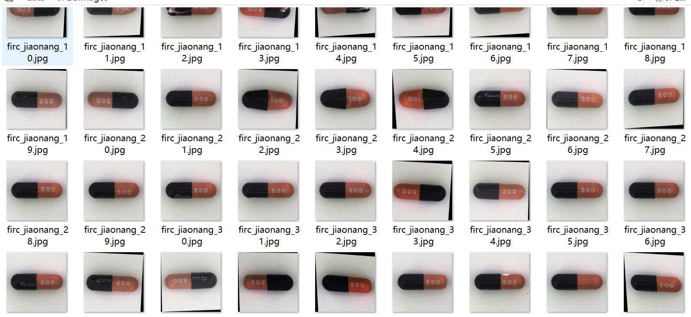
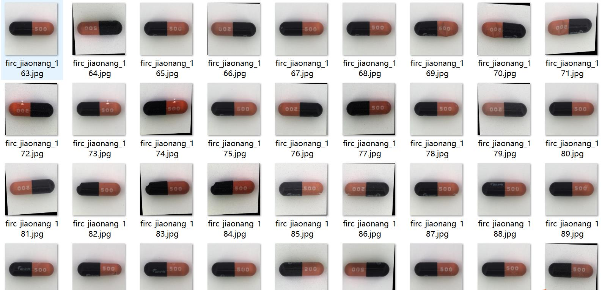
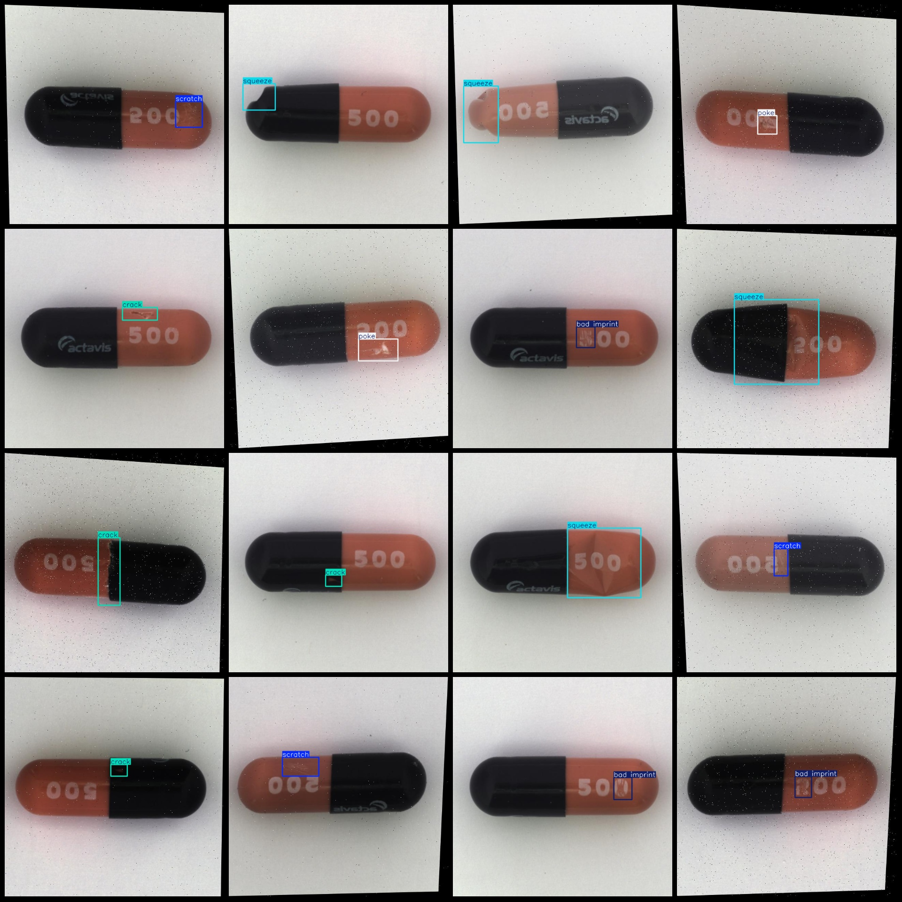
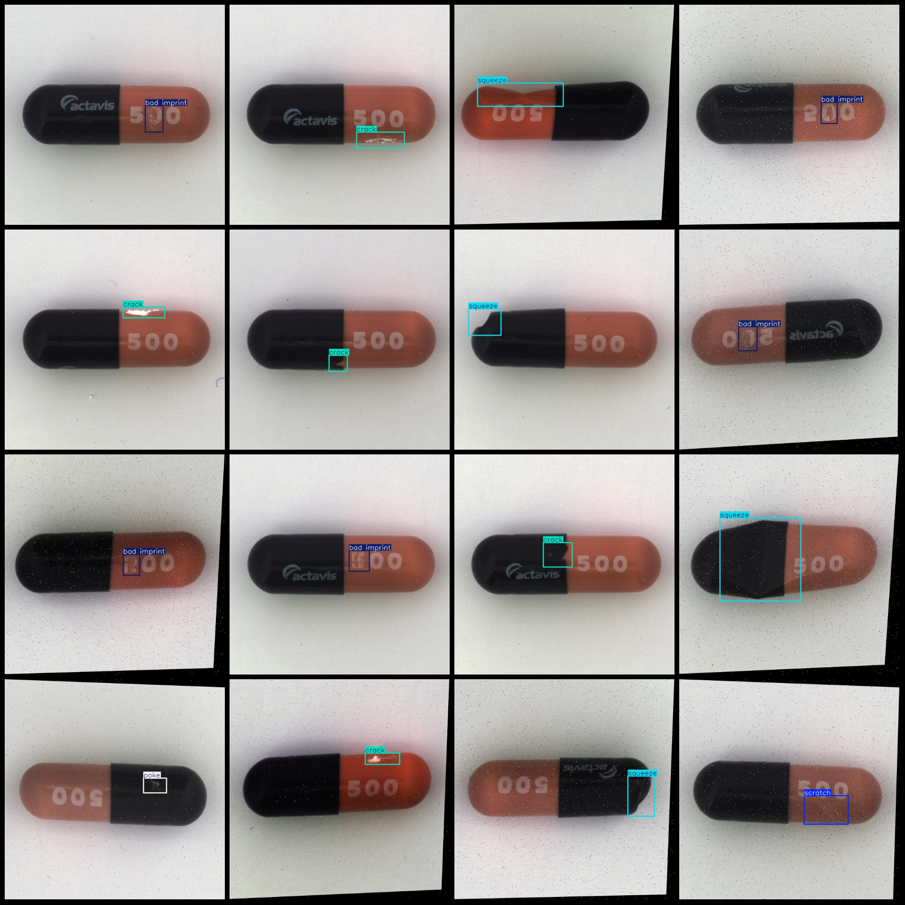

# Medical Supplements Capsule Defect Detection Dataset VOC+YOLO Format with 219 Images in 5 Classes with Enhanced Feature

Please note that in the dataset, approximately 70 images are original images, and the remaining ones are 1:2 rotation enhanced images. Please take a look at the image.
Dataset format: Pascal VOC format + YOLO format (excluding the split path in the txtfile, only including jpg images along with the corresponding VOC format xmlfile and YOLO format txtfile).
number of images: 219  
annotation count: 219  
annotation count: 219  
annotationnumber of classes: 5  
annotation class names (Note that the order in Yolo format does not correspond to this, but is based on the labels file's 'classes.txt'): ['bad imprint', 'crack', 'poke', 'scratch', 'squeeze']
boxes per class:   
Bad imprint, box count = 36  
Crack, box count = 53  
Poke, box count = 43  
Scratch, box count = 45  
Squeeze, box count = 54
total boxes: 231  
images per class:   
Bad imprint (Impression) images = 36  
Crack (Cracks) images = 53  
Poke (Scratch) images = 43  
Scratch (Scratches) images = 43  
Squeeze (Squeezing) images = 44
image resolution: 640x640  
Use annotation tool: labelImg
Annotation rule: draw a rectangle around the class.
Important notes: The dataset does not have separate training, validation, and test sets; you need to divide them yourself.
Special statement: This dataset does not guarantee the accuracy of the trained model or the weights file.
Image preview:
## Images

Here is a pay link on Stripe ( https://buy.stripe.com/3cs8yP7sY87d0vu9AB ). Please contact me lonlonago@foxmail.com after funding $89, and I will send you a complete data files , thank you!

